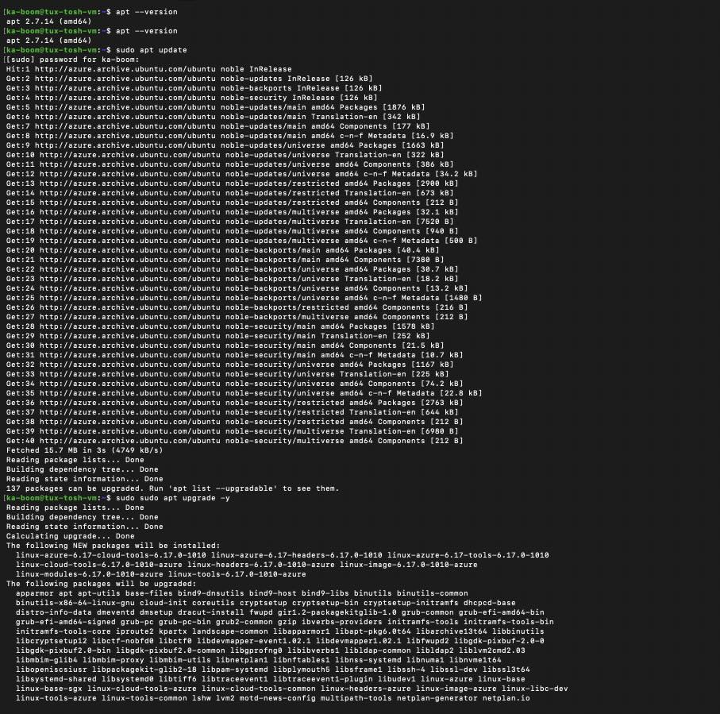
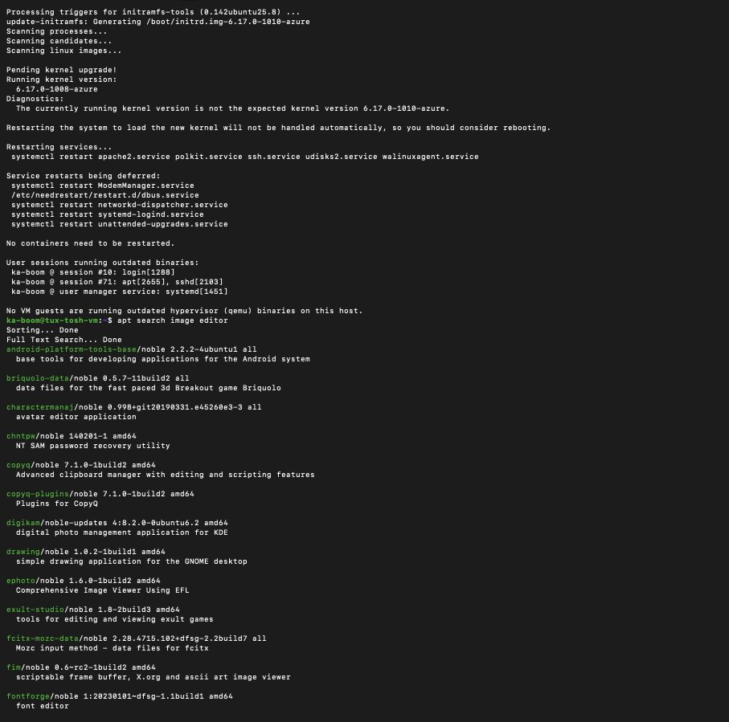
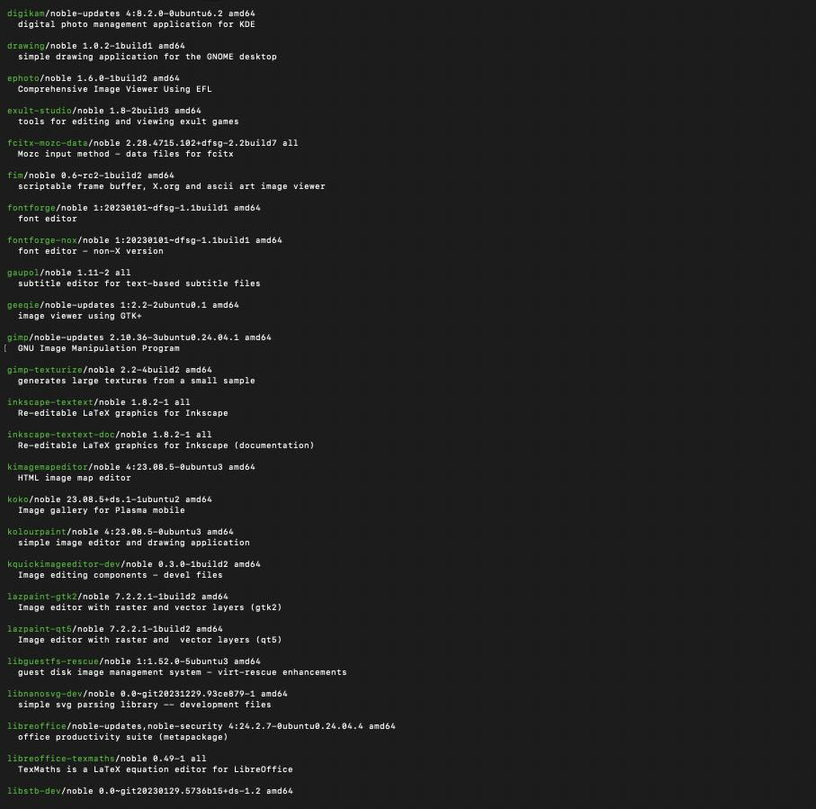
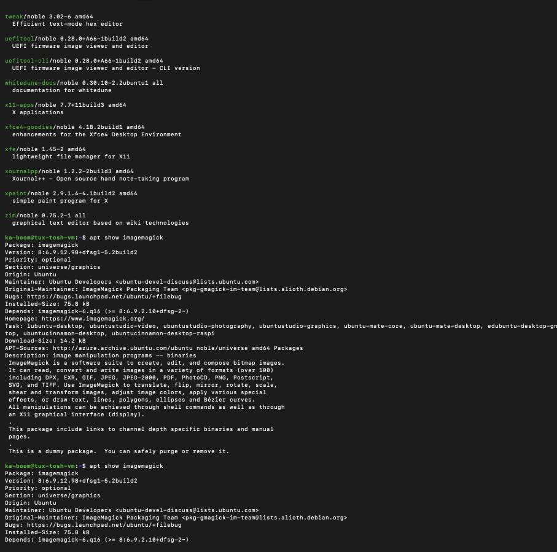
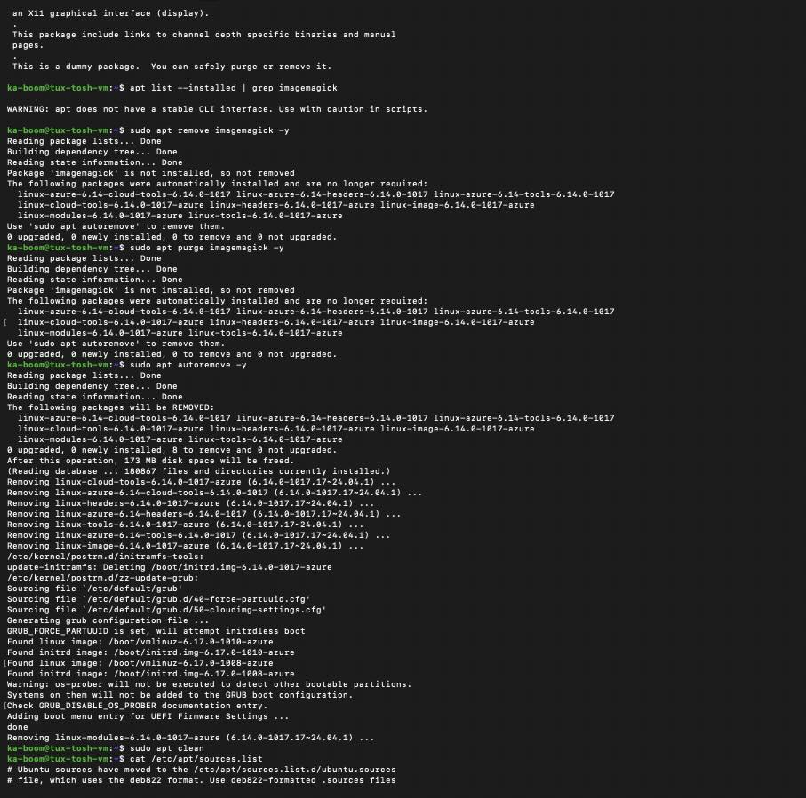

 Report: Package Management with APT

---

## Part 1: Understanding APT & System Updates

### 1. Check APT Version
**Command:** `apt --version`  
**Output:** `apt 2.7.14 (amd64)`

### 2. Update Package List
**Command:** `sudo apt update`  
**Question:** Why is this step important?  
**Answer:** This step is important because it updates the local database of available packages from the repositories. It doesn't install new software but ensures the system knows the latest versions and security patches available before you try to install or upgrade.

### 3. Upgrade Packages
**Command:** `sudo sudo apt upgrade -y`  
**Question:** What is the difference between update and upgrade?  
**Answer:** * **Update:** Refreshes the "catalog" or list of available software (metadata). 
* **Upgrade:** Actually downloads and installs the newer versions of the software you already have on your system.

### 4. View Pending Updates
**Command:** `apt list --upgradable`  

---

## Part 2: Installing & Managing Packages

### 1. Search for a Package
**Command:** `apt search image editor`  
**Selected Package:** `imagemagick`

### 2. View Package Details
**Command:** `apt show imagemagick`  
**Question:** What dependencies does it require?  
**Answer:** Based on the `Depends:` line in the output, it requires `imagemagick-6.q16`, `libmagickcore-6.q16`, and `libc6`.

### 3. Install the Package
**Command:** `sudo apt install imagemagick -y`  

### 4. Check Installed Version
**Command:** `apt list --installed | grep imagemagick`  
**Version Installed:** `8:6.9.12.98+dfsg1-5.2build2`

---

## Part 3: Uninstalling & Cleaning Up

### 1. Uninstall & Purge
**Command:** `sudo apt remove imagemagick -y`  
**Command:** `sudo apt purge imagemagick -y`  
**Question:** What is the difference between remove and purge?  
**Answer:** * **Remove:** Deletes the program files but keeps the configuration settings. 
* **Purge:** Deletes the program files **and** all associated configuration files, leaving no trace.

### 2. Autoremove
**Command:** `sudo apt autoremove -y`  
**Question:** Why is this step important?  
**Answer:** When you delete a program, the "helper" files (dependencies) it came with are often left behind. `autoremove` cleans up these unnecessary files to save disk space and keep the system organized.

### 3. Clean
**Command:** `sudo apt clean`  
**Question:** What does this command do?  
**Answer:** It deletes the temporary `.deb` installer files that were downloaded to `/var/cache/apt/archives/`. This is used purely to reclaim disk space.

---

## Part 4: Managing Repositories & Troubleshooting

### 1. List Repositories
**Command:** `cat /etc/apt/sources.list`  
**Observation:** I noticed URLs pointing to `archive.ubuntu.com`. These are organized into sections like `main` (official free software) and `restricted` (proprietary drivers).

### 2. Add Universe Repository
**Command:** `sudo add-apt-repository universe`  
**Question:** What types of packages are found in the universe repository?  
**Answer:** The `universe` repository contains Community-maintained, free, and open-source software.

### 3. Troubleshooting Simulation
**Command:** `sudo apt install fakepackage`  
**Error Message:** `E: Unable to locate package fakepackage`  
**Question:** How would you troubleshoot this issue?  
**Answer:** 1. Check for typos in the package name.
2. Run `sudo apt update` to ensure the local cache is current.
3. Check if the package requires a repository (like `multiverse`) that isn't enabled.
4. Use `apt search` to find the correct name of the package.

