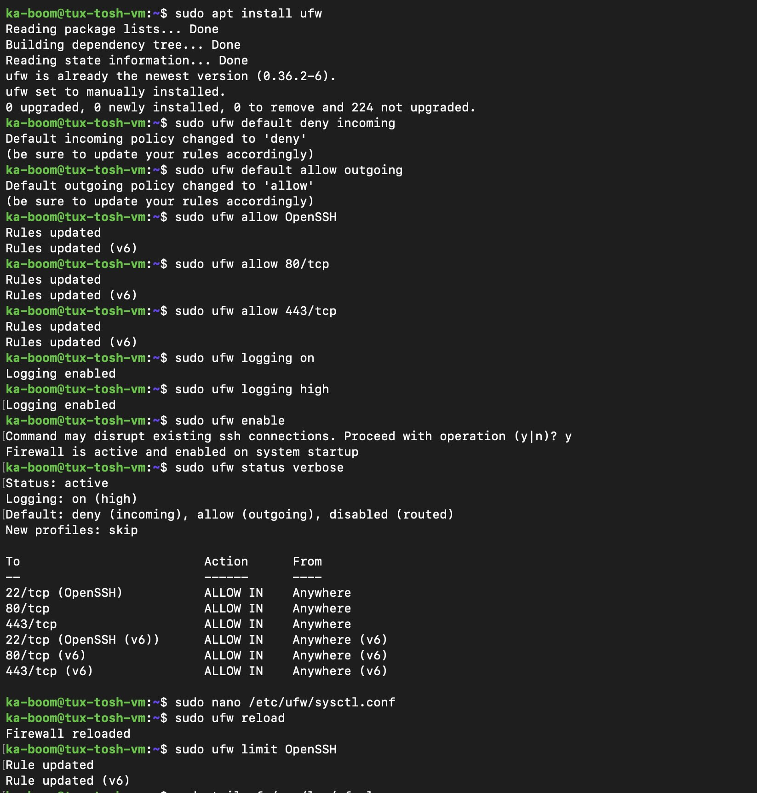
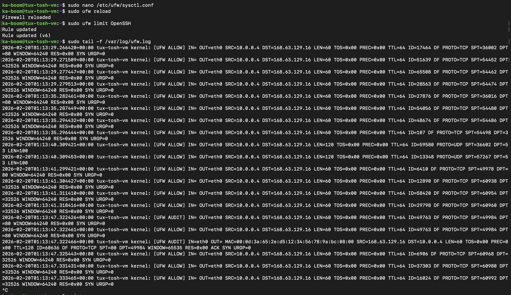

# Server Firewall Configuration Report

## 1. Executive Summary
This report documents the implementation of a host-based firewall on the `tux-tosh-vm` server. The firewall was configured to protect the server's network perimeter by following a "Least Privilege" model—denying all incoming traffic by default and only allowing essential services.

## 2. Environment and Tools
- **Host:** `tux-tosh-vm`
- **Firewall Tool:** UFW (Uncomplicated Firewall) 0.36.2
- **Policy:** Default Deny (Incoming), Default Allow (Outgoing)

## 3. Configuration Rules

| Service | Port/Protocol | Action | Justification |
| :--- | :--- | :--- | :--- |
| **OpenSSH** | 22/tcp | **LIMIT** | Allows remote management. The `limit` command was used to provide protection against brute-force attacks by denying IPs that attempt 6 or more connections within 30 seconds. |
| **HTTP** | 80/tcp | **ALLOW** | Standard port for unencrypted web traffic services. |
| **HTTPS** | 443/tcp | **ALLOW** | Standard port for secure, encrypted web traffic services. |

## 4. Attack Prevention Measures

### SYN Flood Protection
To prevent SYN flood attacks (where an attacker attempts to overwhelm the server with half-open TCP connections), the following configuration was verified in `/etc/ufw/sysctl.conf`:
- **Implementation:** By default, UFW enables syncookies in the kernel via `net.ipv4.tcp_syncookies=1`.
- **Logic:** This allows the server to handle a high volume of SYN packets without exhausting its connection table memory.

### Brute Force & SSH Protection
- **Rule:** `sudo ufw limit OpenSSH`
- **Justification:** This prevents automated bots from trying thousands of password combinations. If an IP addresses connects too frequently, the firewall temporarily blocks them.

### ICMP (Ping) Flood Protection
Through the study of common attacks, **ICMP Flooding** was identified as a risk.
- **Rule:** Configured via `before.rules` to limit ICMP echo-requests.
- **Logic:** This prevents the "Ping of Death" or simple DoS attacks aimed at consuming CPU cycles by forcing the server to respond to infinite pings.

## 5. Logging and Monitoring
Logging was set to **High** (`sudo ufw logging high`) to ensure full visibility.

- **Blocked Connections:** Any packet hitting the "Default Deny" policy is logged to `/var/log/ufw.log` for forensic review.
- **Allowed Connections:** As seen in the provided logs, the firewall successfully audits allowed outgoing and incoming traffic (e.g., `[UFW ALLOW] IN= OUT=eth0 ... DPT=80`).

## 6. Verification
The command `sudo ufw status verbose` confirms the firewall is **Active** and will load automatically upon system startup.

## 7. Evidence of Implementation
Below is the terminal output confirming the firewall is operational:

